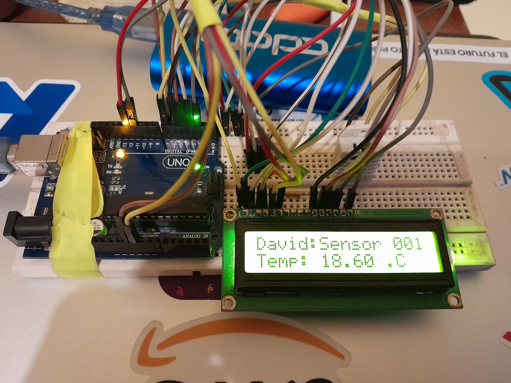

# Temperature and Humidity Sensor | Arduino

- Author: David Castillo Alvarado
- Date: 13 July 2024

Main hardware:

- 16x2 LCD display
- dht22 2301 sensor
- Arduino UNO

Note:

- yes you need potentiometer to catch up the right light up for the LCD background.

Libraries:

- DHT sensor Library from Adafruit 1.4.6
- LCD default library from Arduino

# Connection
## LCD connection:
The circuit:

- LCD RS pin to digital pin 12
- LCD Enable pin to digital pin 11
- LCD D4 pin to digital pin 5
- LCD D5 pin to digital pin 4
- LCD D6 pin to digital pin 3
- LCD D7 pin to digital pin 2
- LCD R/W pin to ground
- LCD VSS pin to ground
- LCD VCC pin to 5V
- 20K resistor:
- ends to +5V and ground
- wiper to LCD VO pin (pin 3)

## DHT22 connection:

- DHT22 PIN1 to PIN2 with 10k ohm resistor
- DHT22 PIN2 to digital pin 7 
- DHT22 PIN4 to ground

## Live Result

